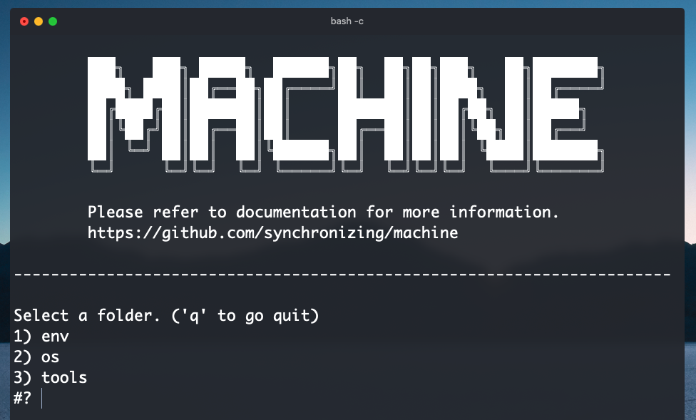

# ☕️ Machine

<p align="center">
  
  <br>
</p>

This is a machine management tool (as oppose to package management tool) that allows the installation and creation of a custom machine setups, including:

* Installing packages with the OS's package manager (`brew`, `apt-get`, `yum`, etc.)
* Install and/or configure:
  * `tmux`
  * `vim`
  * `zsh` or `bash`
* Store and configure dotfiles (the `.*` files that live in your `~` directory.)

---

## Installing

Run the following to begin the installation:

```
sh -c "$(curl -fsSL https://raw.github.com/synchronizing/machine/master/install.sh)"
```

Shorter link:

```
sh -c "$(curl -fsSL self.st/install.sh)"
```

---

## Understanding Project Structure

To understand how to create your own configuration you need to first understand how the project is structured. The following are the root files (top two) and folders (bottom three):

```tree
├── README.md
├── install.sh
│
├── install
├── settings
└── src
```

In simple terms, `install.sh` gives a simple UI to allow running the install files (`.sh` files) inside the `settings` folder. The files inside `settings` will install the content inside the `install` folder.

### `machine/install/`

```tree
install
├── osx
│   ├── dotfiles
│   └── packages
│       ├── brew-cask.txt
│       └── brew.txt
├── ubuntu
│   └── packages
│       └── apt-get.txt
└── universal
    ├── dotfiles
    ├── packages
    │   ├── atom.txt
    │   ├── package-manager.txt
    │   └── pip.txt
    ├── themes
    │   └── machine.zsh-theme
    └── versions
        └── versions.sh
```

The install folder holds the files and configurations to install. The "universal" folder is _always_ installed.

### `machine/src/`

```tree
src
├── install
│   ├── dotfiles.sh
│   ├── misc.sh
│   ├── packages.sh
│   ├── tmux.sh
│   ├── vim.sh
│   └── zsh.sh
└── menus.sh
```

This folder holds files that contain functionalities that can be used to install different configurations.

### `machine/settings/`

```tree
settings
├── env
│   ├── general.sh
│   ├── manual.sh
│   └── minimum.sh
├── os
│   ├── osx.sh
│   └── ubuntu.sh
└── tools
    └── clean.sh
```

These are the current installations and tools available to the end-user. `install.sh` automatically generates the menu to allow the running of these files.

## Creating Own Configuration

If you want to create your own configuration it is as simple as calling a few functions in a `.sh` file. Let's do it by example- let us assume you want to create a configuration for a `fedora` system. You have done a fork and `git pull` of the project to your desktop, and you add the following:

### First

Create the `fedora` folder inside `machine/install/` with the relevant installation files:

```tree
install
├── fedora
│   ├── dotfiles
│   ├── packages
│   └── themes
├── osx
├── ubuntu
└── universal
```

Inside each folder, place the relevant file. Notice:

* `dotfiles`: Place any file you want to be moved to your home (`~`) folder.
* `packages`: Place a `.txt` file with the packages you would like to install.
* `themes`: Place any theme file you would like to install.

### Second

Create a file `machine/settings/os/fedora.sh`, which will contain a `run` function. So take the `osx` installation as an example:

```bash
#!/bin/bash

FOLDER=$INSTALL/osx
DOTFILES=$FOLDER/dotfiles
PACKAGES=$FOLDER/packages

function run() {
  misc_install_general

  brew_install
  package_txt_install package_brew_install $PACKAGES/brew.txt
  package_txt_install package_brew_cask_install $PACKAGES/brew-cask.txt
  dotfile_install $DOTFILES
}
```

All the functions you see being called are described in the [wiki](https://raw.github.com/synchronizing/machine). For the case of our `fedora` system we might do something like so:

```bash
#!/bin/bash

FOLDER=$INSTALL/fedora
DOTFILES=$FOLDER/dotfiles
PACKAGES=$FOLDER/packages
THEMES=$FOLDER/theme

function run() {
  package_txt_install package_yum_install $PACKAGES/yum.txt
  dotfile_install $DOTFILES
}
```

### Third

Push the changes up to your `git` repository via `git add . && git push`, and then run the installation on your `fedora` machine:

```bash
GITHUB_USERNAME="synchronizing"
sh -c "$(curl -fsSL https://raw.github.com/$GITHUB_USERNAME/machine/master/install.sh)"
```
